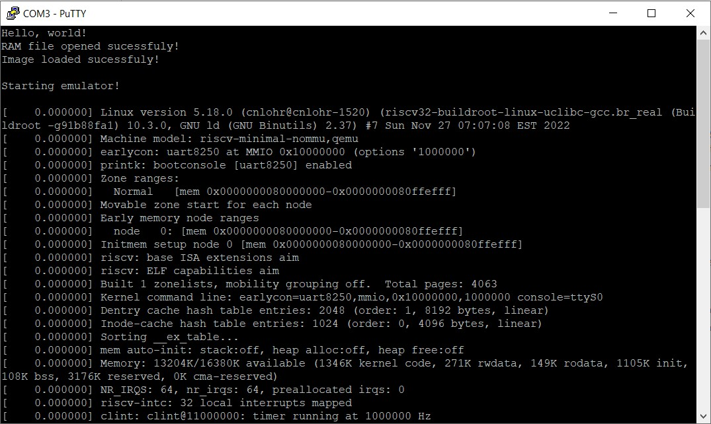
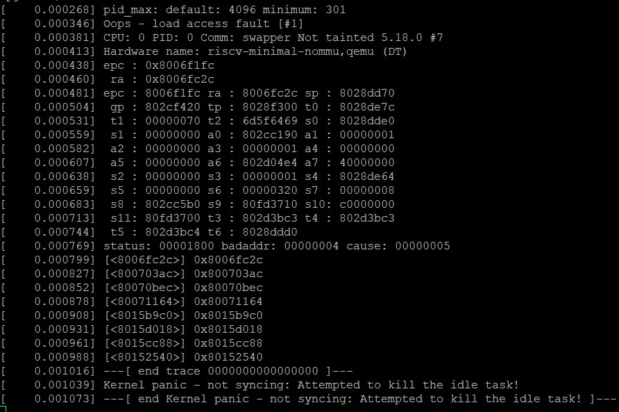

# pico-rv32ima
RISC-V emulator for RP2040, with the goal of running Linux.\
Based on [mini-rv32ima by CNLohr](https://github.com/cnlohr/mini-rv32ima).

## How it works
This project uses [CNLohr's mini-rv32ima](https://github.com/cnlohr/mini-rv32ima) RISC-V emulator core to boot the Linux kernel on a Raspberry Pi Pico. The emulator uses a file-backed RAM stored on an SD card, with a cache in the SRAM of the RP2040 to improve performance. 

## Requirements 
- a Raspberry Pi Pico (or other RP2040 board)
- an SD card (any capacity will work, the emulator only uses about 20MB of it)
- a UART adapter (direct USB console is not implemented yet)

## How to use
The hardware is configured as follows:
- The SD card is connected via SDIO, with the following pinout:
    - CLK: GPIO17
    - CMD: GPIO18
    - D0:  GPIO19
    - D1:  GPIO20
    - D2:  GPIO21
    - D3:  GPIO22
- The serial console is connected to UART0, with TX on GPIO0 and RX on GPIO1, at 115200 baud.

The SD card needs to be formatted as FAT32 or exFAT. I tested block sizes from 1024 to 4096 bytes and they all worked. The Linux kernel and filesystem are provided in the [Image](Image) file (which comes from [this repository](https://github.com/cnlohr/mini-rv32ima-images)). It should be placed in the root of the SD card, along with an empty file called `ram.bin` which should be at least 16 megabytes in size.

## What it does
On startup, the emulator will copy the Linux image into RAM. After about 20 seconds, Linux kernel messages will start streaming on the serial console.

Unfortunately, after another 20 seconds, the kernel will panic with a `Read access fault`. It always happens at the same address, at the same spot in the boot process. This is something that I am still investigating. The emulator and RAM caching code works fine when compiled for x86 Linux but always crashes in the exact same way on the Pico. _Any help or suggestions are strongly appreciated!_