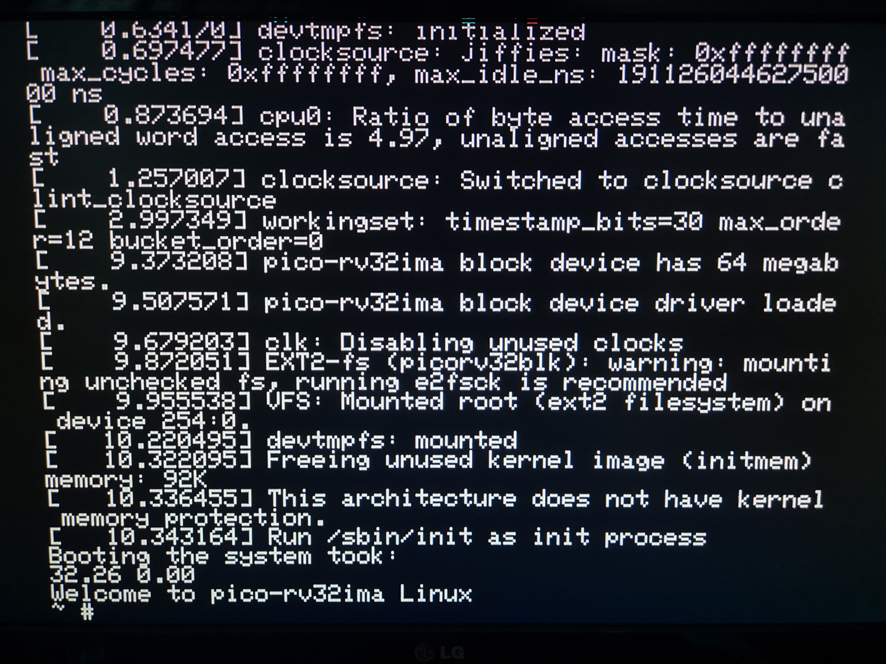
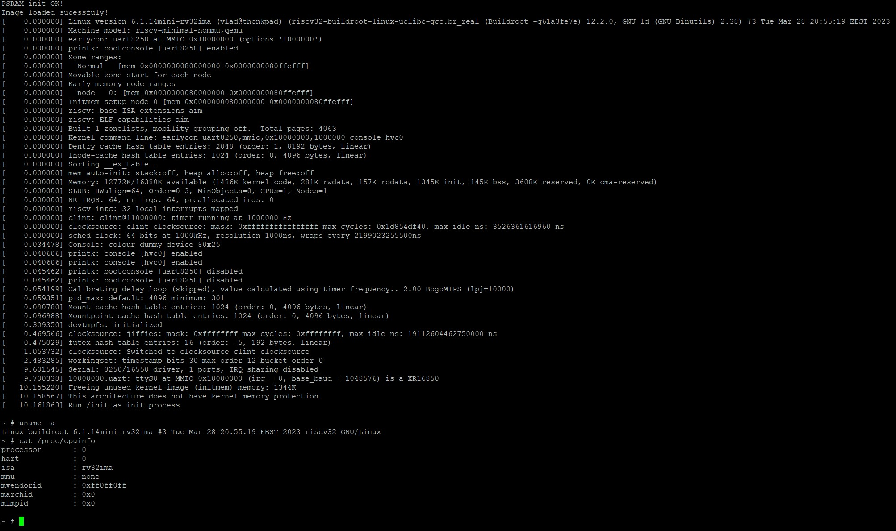

# pico-rv32ima
Running Linux on the RP2040 (and RP2350)

## How it works
This project uses [CNLohr's mini-rv32ima](https://github.com/cnlohr/mini-rv32ima) RISC-V emulator core to run Linux on a Raspberry Pi Pico, using SPI PSRAM chips as system memory. The Linux kernel and root filesystem are stored on an SD card.

## Features
- No-MMU 32bit RISC-V Linux
- 8 or 16 megabytes of RAM
- SD card block device
- VGA text display and PS/2 keyboard support
- 128 kilobytes of 2-way set associative cache

## Requirements 
- a Raspberry Pi Pico or Pico 2 (or other RP2040 or RP2350 boards)
- an SD card
- one or two 8 megabyte (64Mbit) SPI PSRAM chips (LY68L6400 and ESP-PSRAM64H are known to be working).
- (optional, if using the VGA console) 3.3V level shifter for the PS/2 keyboard and a few resistors for the VGA interface.

_This project overvolts and overclocks the microcontroller! Use at own risk!_

## How to use
This project is meant to be used with the official Pi Pico VS Code extension.
The configuration and pin mapping can be modified in the [rv32_config.h](pico-rv32ima/rv32_config.h) file.

- The SD card operates in SPI mode, with the following default pinout:
    - CLK: GPIO2
    - MISO: GPIO4
    - MOSI: GPIO3
    - CS: GPIO0

- The RAM chips are connected with the following default pinout:
    - CLK: GPIO10
    - MISO: GPIO12
    - MOSI: GPIO11
    - CS1: GPIO13
    - CS2: GPIO14 (when using two RAM chips)

- The VGA display is connected as follows:
    - VSYNC: GPIO16
    - HSYNC: GPIO17
    - R: GPIO18
    - G and B are the next two consecutive pins.
    - **the R, G and B lines must be connected through 330 ohm resistors to avoid damage to the monitor**

- The PS/2 keyboard data pin is connected to GPIO26 and the clock pin to GPIO27. **5V to 3.3V level shifting must be used between the PS/2 keyboard and the RP2040!**

- The system console can also be exposed over USB-CDC or UART. By default, the VGA and USB consoles are active. This can be changed from the config file.

The SD card needs to be formatted as FAT16 or FAT32. Prebuilt Linux kernel and filesystem images are provided in [this repository](https://github.com/tvlad1234/pico-linux-images). They must be placed in the root of the SD card. If you want to build the image yourself, you need to run `make` in the [`linux`](linux) folder. This will clone the buildroot source tree, apply the necessary config files and build the kernel and root filesystem image.

## What it does
On powerup, the board waits for the BOOTSEL button to be pressed. After it has been pressed, the Linux kernel will be copied into RAM. In a few seconds, kernel messages will start streaming on the console. The boot process takes around 30 seconds. The Linux image includes a fork of the [c4 compiler/interpreter](https://github.com/rswier/c4), the duktape JavaScript interpreter and the Lua interpreter, as well as a variety of Linux utilities and the coremark benchmark.

## Pictures
- VGA console:
    - 

- Serial (USB or UART) console:
    - 
