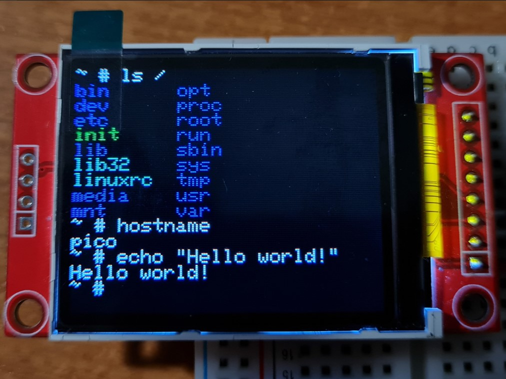

# pico-rv32ima
RISC-V emulator for RP2040, capable of running Linux.\
Based on [mini-rv32ima by CNLohr](https://github.com/cnlohr/mini-rv32ima).

## How it works
This project uses [CNLohr's mini-rv32ima](https://github.com/cnlohr/mini-rv32ima) RISC-V emulator core to run Linux on a Raspberry Pi Pico. It uses two 8 megabyte SPI PSRAM chips as system memory. To alleviate the bottleneck introduced by the SPI interface of the PSRAM, a 4kb cache is used. The cache implementation comes from [xhackerustc's uc32-rvima project](https://github.com/xhackerustc/uc-rv32ima).

## Requirements 
- a Raspberry Pi Pico (or other RP2040 board)
- an SD card
- two 8 megabyte (64Mbit) SPI PSRAM chips (I used LY68L6400).

_This project overvolts and overclocks the RP2040! Use at own risk!_

## How to use
The configuration can be modified in the [rv32_config.h](pico-rv32ima/rv32_config.h) file.

- By default, the SD card is connected via SPI, with the following pinout:
    - CLK: GPIO18
    - MISO: GPIO16
    - MOSI: GPIO19
    - CS: GPIO20
- The SD card may also be connected over SDIO.

- The two RAM chips are connected with the following default pinout:
    - CLK: GPIO10
    - MISO: GPIO12
    - MOSI: GPIO11
    - CS1: GPIO21
    - CS2: GPIO22

- The system console is accessible over USB-CDC, UART or an 128x160 ST7735 display paired with a PS2 keyboard. All three can be used at the same time, but keep in mind they point to the same virtual console. They can be enabled or disabled as desired in the config file. By default, the USB and LCD consoles are enabled.
    - The presence of the LCD and keyboard is not mandatory, even if they're enabled. They're configured with the following default pinout:
        - LCD:
            - SCK: GPIO14
            - MOSI: GPIO15
            - DC: GPIO4
            - RST: GPIO5
            - CS: GPIO 6
        - Keyboard:
            - PS2 DAT: GPIO 3
            - PS2 CK: GPIO 2

The SD card needs to be formatted as FAT32 or exFAT. Block sizes from 1024 to 4096 bytes are confirmed to be working. A prebuilt Linux kernel and filesystem image is provided in [this file](linux/Image). It must be placed in the root of the SD card. If you want to build the image yourself, you need to run `make` in the [linux](linux) folder. This will clone the buildroot source tree, apply the necessary config files and build the kernel and system image.

## What it does
On powerup, the Linux image will be copied into RAM. After a few seconds, Linux kernel messages will start streaming on the console. The boot process takes about one and a half minute.

## Pictures
- Serial (USB or UART) console:
    - 
- LCD console:
    - 