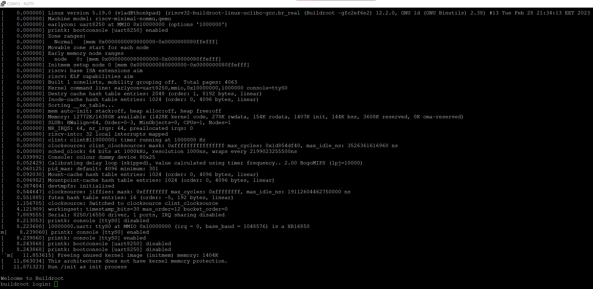

# pico-rv32ima
RISC-V emulator for RP2040, with the goal of running Linux.\
Based on [mini-rv32ima by CNLohr](https://github.com/cnlohr/mini-rv32ima).

## How it works
This project uses [CNLohr's mini-rv32ima](https://github.com/cnlohr/mini-rv32ima) RISC-V emulator core to run Linux on a Raspberry Pi Pico. The emulator uses a file-backed RAM stored on an SD card, with a cache in the SRAM of the RP2040 to improve performance. 

## Requirements 
- a Raspberry Pi Pico (or other RP2040 board)
- an SD card (any capacity will work, the emulator only uses about 20MB of it)

_This project overvolts and overclocks the RP2040! Use at own risk!_
## How to use
The hardware is configured as follows:
- The SD card is connected via SDIO, with the following pinout:
    - CLK: GPIO17
    - CMD: GPIO18
    - D0:  GPIO19
    - D1:  GPIO20
    - D2:  GPIO21
    - D3:  GPIO22
- The text console is accessible over USB CDC. 

The SD card needs to be formatted as FAT32 or exFAT. I tested block sizes from 1024 to 4096 bytes and they all worked. The Linux kernel and filesystem are provided in the [Image](Image) file (which comes from [this repository](https://github.com/cnlohr/mini-rv32ima-images)). It must be placed in the root of the SD card, along with an empty file called `ram.bin` which should be at least 16 megabytes in size.

## What it does
On startup, the emulator will copy the Linux image into RAM. After a few seconds, Linux kernel messages will start streaming on the console. The boot process takes 10 to 15 minutes, after which a login shell will be presented. The username is `root` and there is no password. Unfortunately, after entering the username, it hangs up indefinitely, without ever reaching the shell. I think this happens due to the fact that the emulated CPU is too slow and can't handle the timer interrupts fast enough (which are already not real-time, as they have to be divided by 10 or 20 to get the system to boot).
